<div align="center">


# AI Video Assistant

**Turn any video into notes you can act on.**

Summarize videos and meetings, compare several videos with a research agent
that cites every source and searches the web when it needs to, and turn
meetings into tasks emailed to the people who own them.


</div>

---

## Contents

- [Why](#why)
- [Features](#features)
- [Screenshots](#screenshots)
- [The complete workflow](#the-complete-workflow)
  - [A. Analyze a video](#a-analyze-a-video)
  - [B. Compare & Ask — the research agent](#b-compare--ask--the-research-agent)
  - [C. Meetings → tasks → email](#c-meetings--tasks--email)
  - [How the browser and server talk](#how-the-browser-and-server-talk)
- [Tech stack](#tech-stack)
- [Getting started](#getting-started)
- [Usage](#usage)
- [Configuration](#configuration)
- [API](#api)
- [Project structure](#project-structure)
- [Testing](#testing)
- [Privacy and security](#privacy-and-security)
- [Limitations and roadmap](#limitations-and-roadmap)
- [Documentation](#documentation)
- [Contributing](#contributing)
- [Acknowledgements](#acknowledgements)

---

## Why

Long videos — recorded meetings, lectures, podcasts, talks — hold information
that is expensive to get back out. Finding one decision in a 50-minute
recording means scrubbing through it, and comparing two talks means watching
both.

AI Video Assistant turns recordings into structured notes, answers questions
across them, and closes the loop on meetings by telling each person what they
agreed to do. It runs on your own machine: **audio is transcribed locally with
Whisper and never leaves your computer.** Only text is sent to Gemini.

## Features

| | |
| --- | --- |
| **Detailed summaries** | Section-by-section notes merged into one structured report whose length scales with the video |
| **Action items, decisions, open questions** | Each pulled out into its own tab |
| **Searchable transcript** | Full text with instant highlighting and a match count |
| **Ask the video** | Follow-up questions answered from the video only, with numbered citations |
| **Research agent** | Workspaces of 2+ videos: side-by-side comparison and a tool-using agent that searches the videos, reads summaries, and uses **Google Search** when the videos don't cover it — citing `[V1-3]` excerpts and `[W2]` web sources |
| **Meeting analysis** | Upload a recording in Meeting mode: minutes, plus structured tasks with owner, deadline, and the quote they came from |
| **Contacts & @mentions** | Owners matched to saved contacts by name, alias, or first name; reassign by typing `@` |
| **Task emails** | One email per person listing their tasks — reviewed, editable, and sent over SMTP only after you confirm. Dry-run by default |
| **Live progress** | Named stages, per-chunk messages, percent, elapsed time, and a cancel button |
| **History** | Finished analyses, workspaces, contacts, tasks, and emails are saved in SQLite |
| **Export** | Copy any section, or download the full report (including minutes, tasks, and Q&A) as `.md` or `.txt` |
| **Resilient** | Gemini calls retry busy/rate-limited responses and fall back to a second model |
| **Polished UI** | Landing page, light and dark themes, animations, keyboard shortcuts, responsive to 375px, accessible |

## Screenshots

**Compare & Ask** — a workspace with two talks and a meeting, a generated comparison, and the research agent.

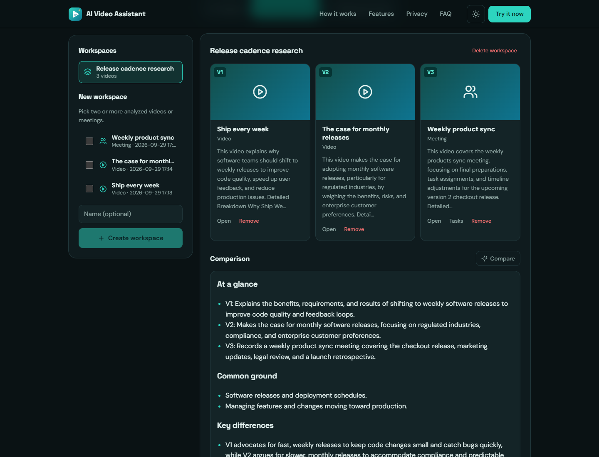

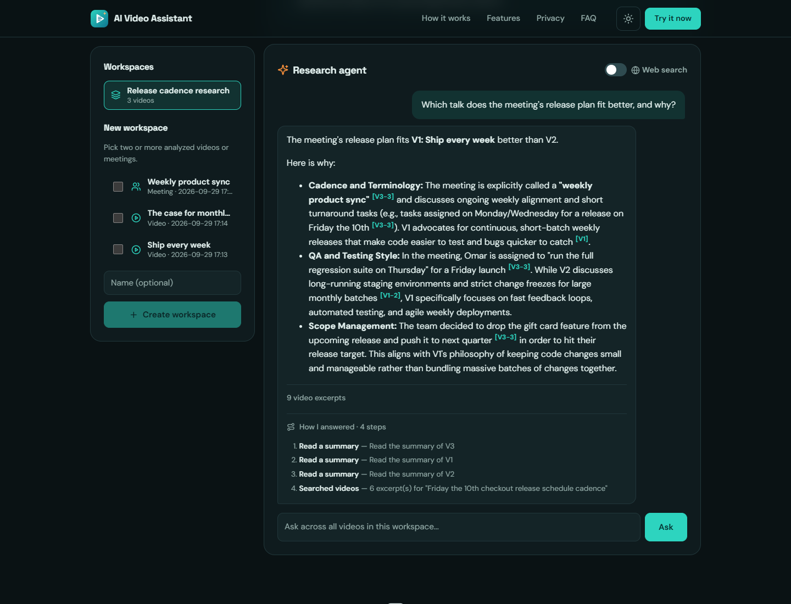

**Meetings** — tasks matched to contacts, `@mention` reassignment, and reviewed email drafts.

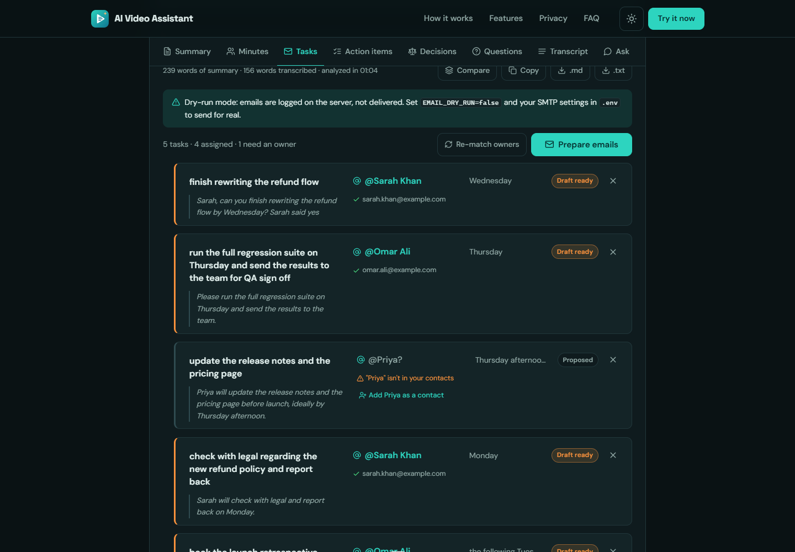

| `@mention` an owner | Confirm before sending |
| --- | --- |
| 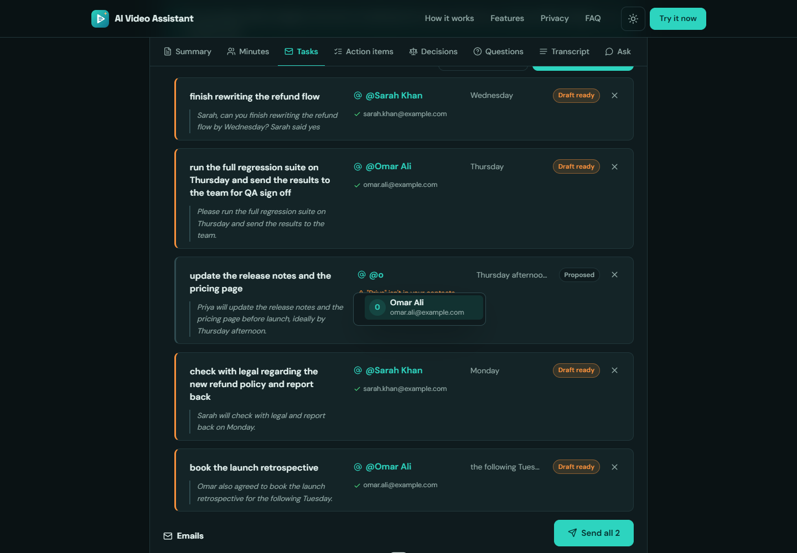 | 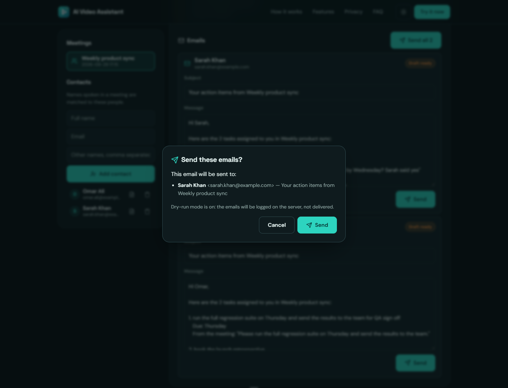 |

| Email drafts | Meetings & contacts |
| --- | --- |
| 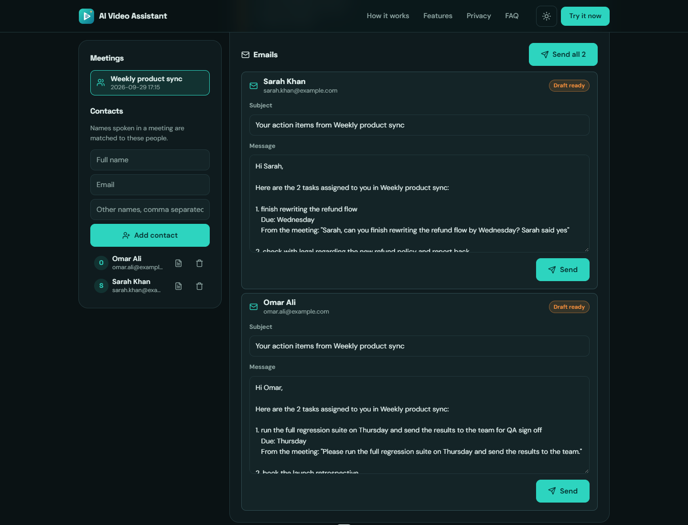 | 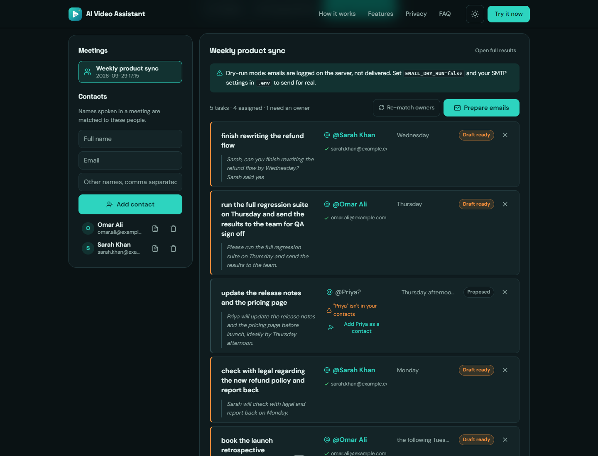 |

**Analyze** — meeting mode with an uploaded recording, live progress, and results.

| Meeting mode + upload | Live progress |
| --- | --- |
| 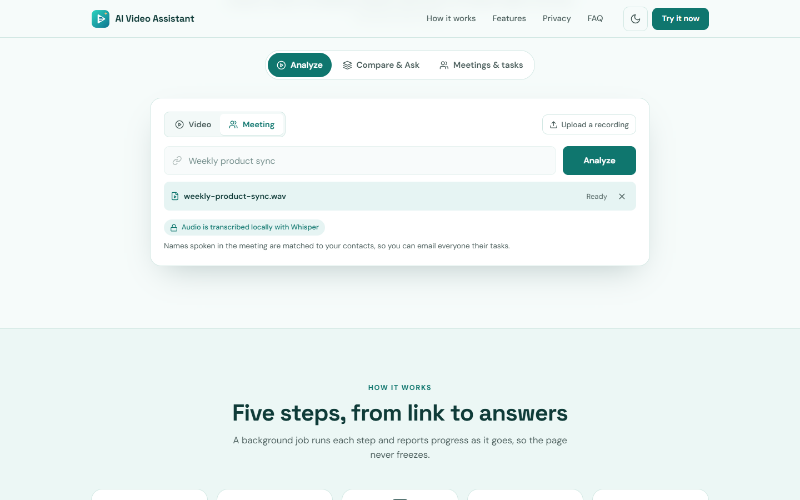 |  |

| Results | Ask the video |
| --- | --- |
|  |  |

| Light theme | Features | Mobile |
| --- | --- | --- |
|  |  | 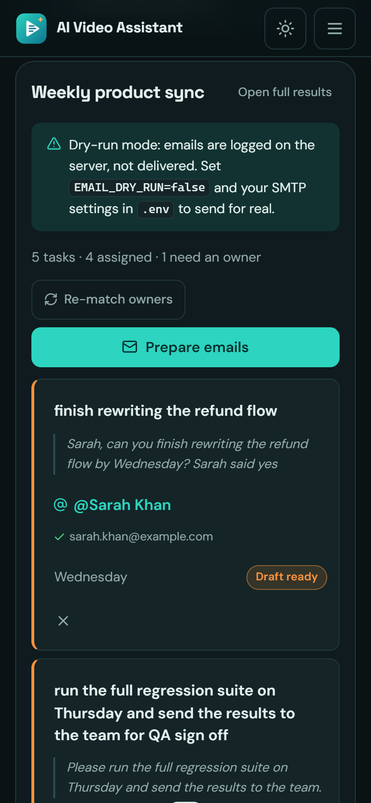 |

> All results shown are real runs. The two "talks" and the meeting are short
> recordings generated with text-to-speech for the demo; the email is in
> dry-run mode and the contacts use `example.com` addresses.

---

## The complete workflow

The app has three tools, switched with the pills above the analyzer:
**Analyze**, **Compare & Ask**, and **Meetings & tasks**.

### A. Analyze a video

1. **Paste** a YouTube URL, or **upload / drop** an audio or video file, and
   press **Analyze**.
2. **Watch it run** — title, channel, duration, and thumbnail appear within
   seconds; a stepper shows each stage with per-chunk progress. **Cancel**
   anytime.
3. **Read the results** in tabs: Summary · Action items · Decisions ·
   Questions · Transcript · Ask.
4. **Ask follow-ups** — answers cite excerpts as `[1]`, `[2]`.
5. **Export**, or press **Compare** to add the video to a workspace.

```mermaid
flowchart LR
    A([YouTube URL<br/>or uploaded file]) --> B[1 · Download<br/>yt-dlp + FFmpeg]
    B --> C[2 · Transcribe<br/>Whisper, locally]
    C --> D[3 · Summarize<br/>map-reduce]
    D --> E[4 · Extract<br/>actions · decisions · questions]
    E --> F[5 · Index<br/>Chroma + local MiniLM]
    F --> G([Results · saved to SQLite])
    G -. question .-> H[Ask<br/>top-6 excerpts → Gemini]
    H -. cited answer .-> G

    classDef local fill:#0f766e,stroke:#2dd4bf,color:#fff
    classDef cloud fill:#9a3412,stroke:#fb923c,color:#fff
    class B,C,F local
    class D,E,H cloud
```

<sub>Teal steps run on your machine. Orange steps send **text only** to Gemini (or Mistral for summaries, if configured).</sub>

| # | Stage | Module | What it does |
| --- | --- | --- | --- |
| 1 | **Download** | [`utils/audio_processor.py`](utils/audio_processor.py) | `yt-dlp` fetches the audio and metadata; FFmpeg converts to mono 16 kHz WAV; split into 10-minute chunks. Uploads skip the download |
| 2 | **Transcribe** | [`core/transcriber.py`](core/transcriber.py) | Whisper, locally — `faster-whisper` (int8, voice-activity filter) with `openai-whisper` as a fallback |
| 3 | **Summarize** | [`core/summarize.py`](core/summarize.py) | Notes per 6,000-character section, combined into one summary whose length is banded to the transcript |
| 4 | **Extract** | [`core/extractor.py`](core/extractor.py) | Three focused calls: action items, decisions, open questions |
| 5 | **Index** | [`core/vector_store.py`](core/vector_store.py) | Transcript and sections embedded into a persistent local Chroma store. Never fails the job |
| — | **Ask** | [`core/rag_engine.py`](core/rag_engine.py) | Retrieves the six most relevant chunks for that video and answers with `[n]` citations — or says the video doesn't cover it |

### B. Compare & Ask — the research agent

1. Open **Compare & Ask**, tick two or more analyzed videos (or meetings), and
   **Create workspace**. They become **V1**, **V2**, ….
2. Press **Compare** for a side-by-side write-up: at a glance · common ground ·
   key differences · unique to each · which to watch.
3. **Ask the agent** anything across the videos. Leave **Web search** on to let
   it use Google when the videos don't cover the question.
4. Each answer shows **citations** — `[V1-3]` an excerpt, `[V1]` a summary,
   `[W2]` a web page — a sources list (click a citation to jump to it), and
   **How I answered**, the tools it used.

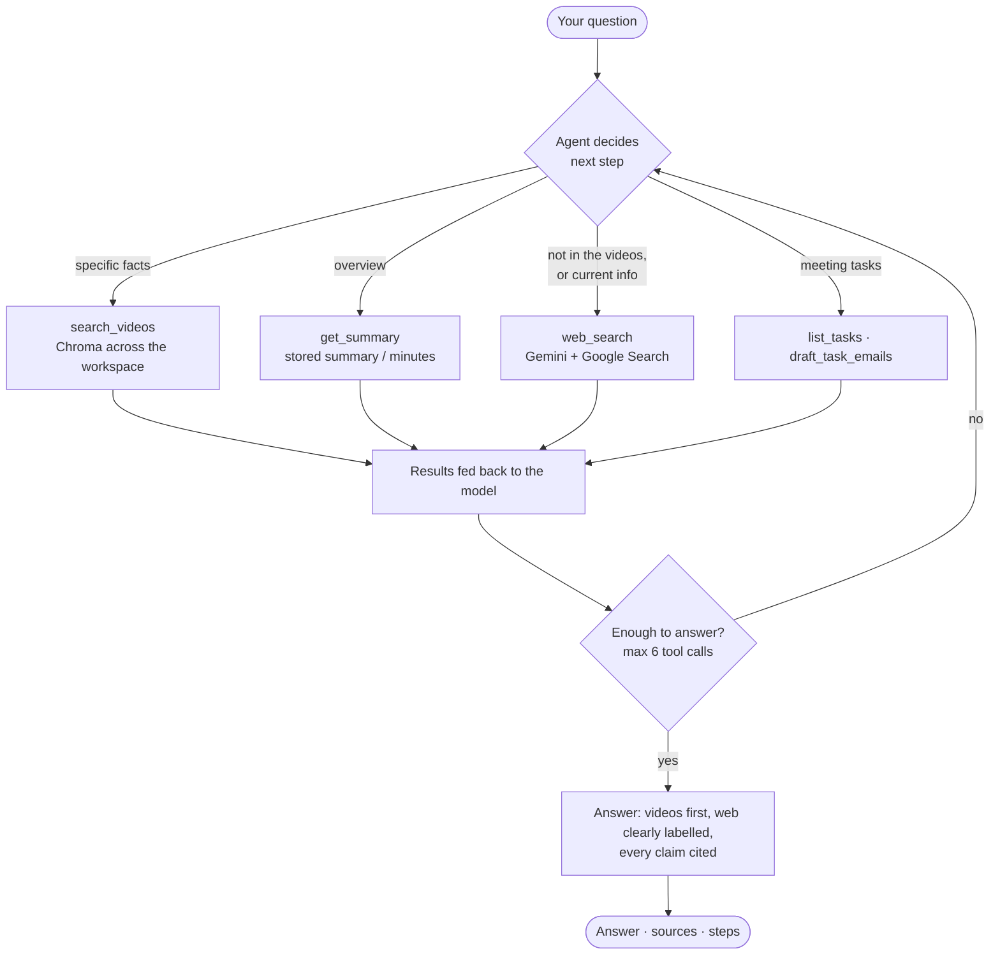

**How it picks the best answer:** the agent searches the videos first, reads
summaries for overviews, and only uses the web to fill gaps or for current
facts. It never presents web content as something a video said, and it says so
when neither source has the answer. It runs on native Gemini function calling
([`core/agent/`](core/agent/)), falls back to your summary model if the agent
model is busy or out of quota, and **has no tool that can send email**.

### C. Meetings → tasks → email

1. Add the people you meet with under **Meetings & tasks → Contacts** (with
   nicknames under "Other names").
2. In **Analyze**, choose **Meeting**, upload the recording, and press
   **Analyze**. A sixth **Tasks** stage runs.
3. The **Tasks** tab lists every task with its owner, deadline, and the quote
   it came from. Owners are matched to contacts (✓) or flagged (⚠).
4. Fix anything inline: type `@` in the owner field to reassign, edit the text
   or deadline, dismiss what isn't a task, or **Add Priya as a contact** in one
   step.
5. **Prepare emails** — one draft per person listing all their tasks. Review
   and edit each one.
6. **Send** (or **Send all**) → a confirmation dialog lists every recipient →
   confirm. Statuses update to *Emailed*; failures show why and can be retried.

You can also ask the agent "email everyone their tasks" — it **prepares
drafts only** and shows a *Review & send* card.

```mermaid
flowchart LR
    U([Recording]) --> T[Transcribe<br/>locally]
    T --> M[Minutes<br/>attendees · agenda · decisions]
    T --> X[Extract tasks<br/>owner · due · evidence]
    X --> C[Match owners<br/>name · alias · first name · fuzzy]
    C --> R([Review<br/>@mention · edit · dismiss])
    R --> D[Draft one email<br/>per contact]
    D --> V{You confirm?}
    V -->|Send| S[SMTP<br/>or dry-run log]
    V -->|Edit| R

    classDef human fill:#1d4ed8,stroke:#60a5fa,color:#fff
    class R,V human
```

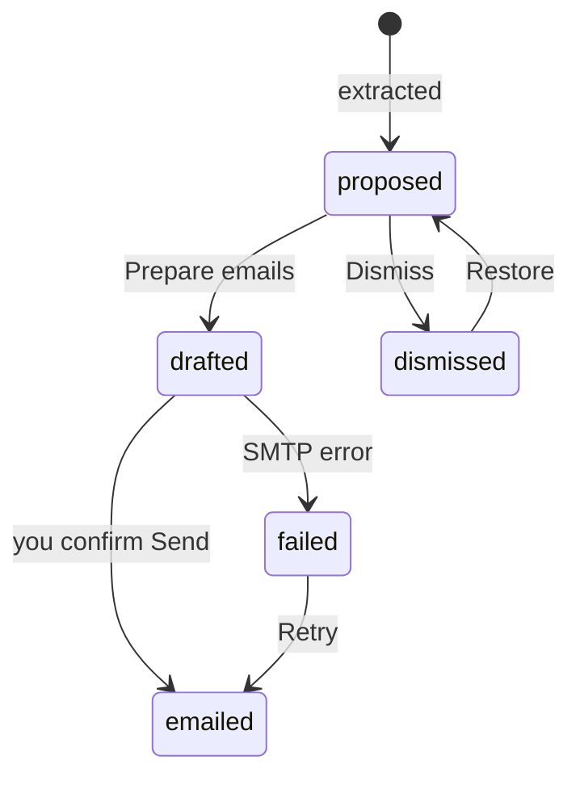

**Safety by design:** emails go only to saved contacts (re-checked at send
time), only through the confirmation dialog, at most 20 a minute, and in
dry-run mode until you configure SMTP. Transcripts and web pages are treated
as data, so an instruction spoken in a meeting can't make the app email
anyone.

### How the browser and server talk

Transcription can take minutes, so analysis runs as a **background job** the
browser polls every two seconds. Finished analyses are written to SQLite, so
history, workspaces, and Q&A survive restarts.

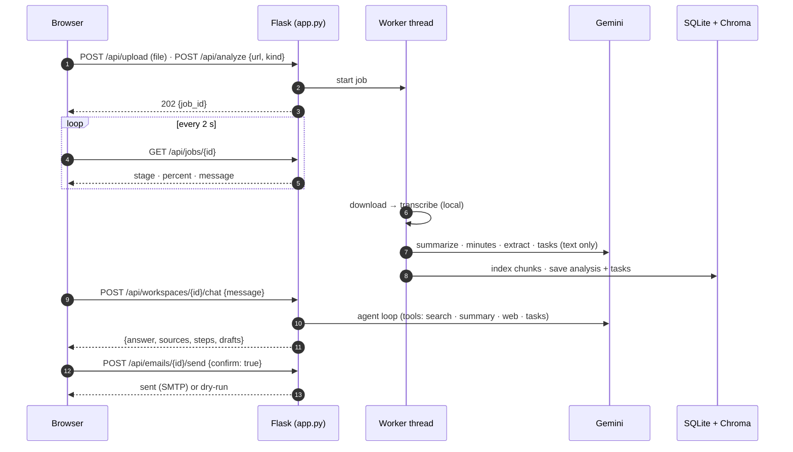

Deeper detail: [docs/ARCHITECTURE.md](docs/ARCHITECTURE.md).

---

## Tech stack

| Layer | Technology |
| --- | --- |
| Backend | Python 3.10+, Flask, background threads |
| Audio | yt-dlp, FFmpeg, pydub |
| Transcription | faster-whisper (preferred) / openai-whisper — local |
| LLM | Google Gemini via REST — summaries, Q&A, function-calling agent, Google Search grounding; optional Mistral for summaries |
| Retrieval | ChromaDB with local ONNX all-MiniLM-L6-v2 embeddings |
| Storage | SQLite (stdlib) |
| Email | SMTP (stdlib `smtplib`, STARTTLS/SSL) |
| Frontend | Plain HTML, CSS, and JavaScript — no framework, no build step |
| Tests | Dependency-free Python and Node suites |

---

## Getting started

### Prerequisites

| Requirement | Check |
| --- | --- |
| Python 3.10+ (developed on 3.11) | `python --version` |
| [FFmpeg](https://ffmpeg.org/download.html) on your `PATH` | `ffmpeg -version` |
| A [Google AI Studio API key](https://aistudio.google.com/apikey) | — |
| ~1 GB free disk for models and audio | — |
| *Optional:* an SMTP account (e.g. Gmail + App Password) to send task emails | — |

Install FFmpeg with `winget install Gyan.FFmpeg` (Windows),
`brew install ffmpeg` (macOS), or `sudo apt install ffmpeg` (Debian/Ubuntu),
then open a new terminal.

### Install

```bash
git clone https://github.com/hmzasaed/video-agent-AI.git
cd video-agent-AI

python -m venv .venv
# Windows (PowerShell)
.\.venv\Scripts\Activate.ps1
# macOS / Linux
source .venv/bin/activate

pip install -r Requirements.txt
```

### Configure

```bash
# Windows: Copy-Item .env.example .env
cp .env.example .env
```

Set at least your Gemini key in `.env`:

```ini
GOOGLE_API_KEY=your_actual_key_here
```

To send task emails (optional — dry-run until you do):

```ini
EMAIL_DRY_RUN=false
SMTP_HOST=smtp.gmail.com
SMTP_PORT=587
SMTP_USER=you@gmail.com
SMTP_PASSWORD=your_16_character_app_password
SMTP_FROM=you@gmail.com
```

Gmail needs 2-Step Verification and an **App Password** (Google Account →
Security → App passwords). `.env` is git-ignored — never commit it.

### Run

```bash
python app.py
```

Open **<http://127.0.0.1:5000>**. Check the configuration took effect:

```bash
curl http://127.0.0.1:5000/api/health
# {"status":"ok","whisper_model":"base","gemini_key_configured":true,
#  "web_search_enabled":true,"smtp_configured":false,"email_dry_run":true,...}
```

**First run is slower:** the Whisper model (~145 MB for `base`) and the Q&A
embedding model (~80 MB) each download once. Full guide:
[docs/SETUP.md](docs/SETUP.md).

---

## Usage

| Action | How |
| --- | --- |
| Analyze a video | Paste a URL (or drop a file), press `Enter` or **Analyze** |
| Analyze a meeting | Switch to **Meeting**, upload the recording, **Analyze** |
| Jump to the input | `Ctrl`/`Cmd` + `K` |
| Switch tools / result tabs | Click, or `←` / `→` |
| Compare videos | **Compare & Ask** → tick videos → **Create workspace** → **Compare** |
| Ask across videos | Workspace chat; toggle **Web search** |
| Reassign a task | Type `@` in the owner field, pick a contact |
| Email tasks | **Prepare emails** → review → **Send** → confirm |
| Manage contacts | **Meetings & tasks** sidebar |
| Toggle theme | Sun/moon button (follows your OS until you choose) |

From the terminal, without the web UI:

```bash
python test.py "https://www.youtube.com/watch?v=..."
```

---

## Configuration

All settings live in `.env` (see [`.env.example`](.env.example)).

| Variable | Default | Effect |
| --- | --- | --- |
| `GOOGLE_API_KEY` | *(required)* | Gemini authentication |
| `GEMINI_MODEL` | `gemini-3.5-flash-lite` | Summaries, extraction, single-video Q&A; agent fallback |
| `GEMINI_AGENT_MODEL` | `gemini-3.5-flash` | Research agent and web search |
| `AGENT_MAX_STEPS` | `6` | Tool calls per agent answer |
| `WEB_SEARCH_ENABLED` | `true` | Google Search grounding (needs quota on your key) |
| `SUMMARY_PROVIDER` | `gemini` | `mistral` to summarize with Mistral (`MISTRAL_API_KEY`, `MISTRAL_MODEL`) |
| `WHISPER_MODEL` | `base` | `tiny` · `base` · `small` · `medium` · `large` |
| `DB_PATH` | `data/app.db` | SQLite database |
| `CHROMA_DIR` | `data/chroma` | Q&A index |
| `RAG_TOP_K` | `6` | Excerpts retrieved per question |
| `MAX_UPLOAD_MB` | `2048` | Upload size limit |
| `EMAIL_DRY_RUN` | `true` | Log emails instead of sending |
| `SMTP_HOST` · `SMTP_PORT` · `SMTP_USER` · `SMTP_PASSWORD` · `SMTP_FROM` | — | Outgoing mail (465 = SSL, otherwise STARTTLS) |

`.env` is read once at startup — restart after changing it.

---

## API

| Method | Endpoint | Purpose |
| --- | --- | --- |
| `POST` | `/api/upload` | Upload a recording → `{path, name}` |
| `POST` | `/api/analyze` | Start a job from `{"url", "kind": "video"\|"meeting", "title"}` → `202 {job_id}` |
| `GET` | `/api/jobs/<id>` | Poll progress, then results (falls back to history) |
| `POST` | `/api/jobs/<id>/cancel` | Ask a running job to stop |
| `POST` | `/api/jobs/<id>/ask` | Question about one video → `{answer, sources}` |
| `GET` | `/api/analyses[/<id>]` | History / one stored analysis |
| `GET` `POST` | `/api/workspaces` | List / create a workspace |
| `GET` `DELETE` | `/api/workspaces/<id>` | Read / delete |
| `POST` `DELETE` | `/api/workspaces/<id>/videos[/<analysis_id>]` | Add / remove a video |
| `POST` | `/api/workspaces/<id>/compare` | Generate the comparison |
| `POST` | `/api/workspaces/<id>/chat` | Research agent → `{answer, sources, steps, drafts}` |
| `GET` `POST` `PUT` `DELETE` | `/api/contacts[/<id>]` | Contacts |
| `GET` | `/api/analyses/<id>/tasks` | Meeting tasks |
| `POST` | `/api/analyses/<id>/tasks/rematch` | Re-match owners to contacts |
| `PATCH` | `/api/tasks/<id>` | Edit / reassign / dismiss a task |
| `POST` | `/api/analyses/<id>/emails/draft` | One draft per person |
| `GET` `PATCH` | `/api/emails?analysis=<id>` · `/api/emails/<id>` | List / edit drafts |
| `POST` | `/api/emails/<id>/send` | Send one draft — requires `{"confirm": true}` |
| `GET` | `/api/health` | Liveness and effective configuration |

```bash
# Analyze a meeting recording
curl -F "file=@weekly-sync.mp4" http://127.0.0.1:5000/api/upload
curl -X POST http://127.0.0.1:5000/api/analyze -H "Content-Type: application/json" \
     -d '{"url": "<path from upload>", "kind": "meeting", "title": "Weekly sync"}'

# Ask the research agent
curl -X POST http://127.0.0.1:5000/api/workspaces/<id>/chat -H "Content-Type: application/json" \
     -d '{"message": "Where do the talks disagree?", "allow_web": true}'
```

Full reference with request/response shapes: [docs/API.md](docs/API.md).

---

## Project structure

```text
app.py                     Flask backend: routes, background jobs, email endpoints
test.py                    Command-line entry point
core/
  gemini_client.py         Gemini REST: text, tools, retries, model fallback
  transcriber.py           Whisper transcription (faster-whisper / openai-whisper)
  summarize.py             Map-reduce summaries (Gemini or Mistral)
  extractor.py             Action items, decisions, questions
  meeting.py               Meeting minutes, structured tasks, owner matching
  vector_store.py          Chroma index (local embeddings), multi-video search
  rag_engine.py            Single-video Q&A with citations
  agent/
    agent.py               Function-calling loop
    tools.py               search_videos · get_summary · web_search · tasks · drafts
    prompts.py             Answer policy and safety rules
    compare.py             Side-by-side comparison
  db.py                    SQLite: analyses, workspaces, contacts, tasks, emails
  drafts.py                One email draft per contact
  mailer.py                SMTP sending (dry-run by default)
utils/
  audio_processor.py       Download, convert, and chunk audio
templates/index.html       Landing page, the three tools, icon sprite, send dialog
static/
  css/style.css            Design tokens, components, motion, themes
  js/main.js               Analyze: jobs, uploads, results, Q&A, tool switcher
  js/agent.js              Compare & Ask: workspaces, comparison, agent chat
  js/meetings.js           Task board, @mentions, contacts, email review
  js/site.js               Landing page: scroll reveals, nav, mobile menu
  img/                     Logo, favicons, illustrations
tests/
  test_api.py              Backend suite (174 checks)
  test_agent.py            Agent suite (45 checks)
  test_frontend.mjs        Frontend suite (54 checks)
docs/                      Full documentation and screenshots
downloads/                 Downloaded audio and uploads (git-ignored)
data/                      SQLite database and Chroma index (git-ignored)
```

---

## Testing

```bash
python tests/test_api.py                 # 174 checks — routes, jobs, uploads, meetings, contacts, email, workspaces
.venv/Scripts/python tests/test_agent.py  # 45 checks — agent loop, tools, citations, Gemini retries/fallback
node tests/test_frontend.mjs             # 54 checks — markdown, XSS escaping, citations, @mention filtering
```

No suite needs an API key or network, and none can send email: Gemini, the
pipeline, and SMTP are stubbed, and the database is a temporary file. The email
tests prove sending fails without confirmation, to a changed address, twice,
or from a prompt-injected transcript. See [docs/TESTING.md](docs/TESTING.md).

---

## Privacy and security

| Data | Where it goes |
| --- | --- |
| Audio | **Stays on your machine** — downloaded, converted, and transcribed locally |
| Q&A embeddings, history, contacts | **Stay on your machine** — `data/` |
| Transcript text | Sent to Gemini (or Mistral) for summaries, minutes, extraction |
| Questions | Sent to Gemini with excerpts from your videos |
| Web searches | The agent's search query goes to Google |
| Task emails | Sent from your SMTP account, to saved contacts only, after you confirm |
| API key, SMTP password | Read from `.env`; never logged or returned |

> [!WARNING]
> This is a **local, single-user development server**. It has no
> authentication, runs with Flask's debugger on, and can send email from your
> account. Keep it bound to `127.0.0.1`. Read [docs/SECURITY.md](docs/SECURITY.md)
> before exposing it to any other machine.

---

## Limitations and roadmap

**Known limits:** owners come from names spoken — Whisper doesn't identify
speakers; Google Search grounding needs quota on your Gemini key (free-tier
keys may have none); cancellation waits for the current audio chunk; prompts
assume English; `downloads/` is never cleaned up.

**Next up:** speaker diarization for meetings, cleanup of `downloads/`,
calendar/Jira/Linear integrations, caching by video ID, streaming agent
answers, and optional local-LLM support. See [docs/ROADMAP.md](docs/ROADMAP.md).

---

## Documentation

| Document | For |
| --- | --- |
| [PRD](docs/PRD.md) | What it does and what counts as done |
| [Architecture](docs/ARCHITECTURE.md) | How it is built and why — pipeline, agent, email, storage |
| [Design](docs/DESIGN.md) | UI tokens, landing page, tools, components, accessibility |
| [API](docs/API.md) | Endpoint reference |
| [Setup](docs/SETUP.md) | Installing, SMTP, Mistral |
| [Testing](docs/TESTING.md) | Running and extending the suites |
| [Troubleshooting](docs/TROUBLESHOOTING.md) | Fixing a specific error |
| [Security](docs/SECURITY.md) | Trust boundaries, email safety, prompt injection |
| [Decisions](docs/DECISIONS.md) | Architecture decision records |
| [Roadmap](docs/ROADMAP.md) | What's shipped and what's next |
| [Contributing](docs/CONTRIBUTING.md) | Adding code and agent tools |

---

## Contributing

1. Follow [docs/SETUP.md](docs/SETUP.md) and confirm all three test suites pass.
2. Match the existing style (see [docs/CONTRIBUTING.md](docs/CONTRIBUTING.md)).
3. Keep model- and user-supplied text going through `escapeHtml()` or
   `renderMarkdown()` before it reaches `innerHTML`.
4. Never add an agent tool or code path that sends email without the user's
   confirmation.
5. Confirm `git status` shows no `.env`, `downloads/`, or `data/`, then open a
   pull request.

---

## Acknowledgements

- [OpenAI Whisper](https://github.com/openai/whisper) and
  [faster-whisper](https://github.com/SYSTRAN/faster-whisper) for local
  transcription
- [yt-dlp](https://github.com/yt-dlp/yt-dlp) for downloading audio
- [Google Gemini](https://ai.google.dev/) for summaries, the agent, and Search grounding
- [Chroma](https://www.trychroma.com/) for the local vector store
- [Lucide](https://lucide.dev/) icons (ISC licence)
- [Space Grotesk](https://fonts.google.com/specimen/Space+Grotesk) and
  [DM Sans](https://fonts.google.com/specimen/DM+Sans) (SIL Open Font Licence)
