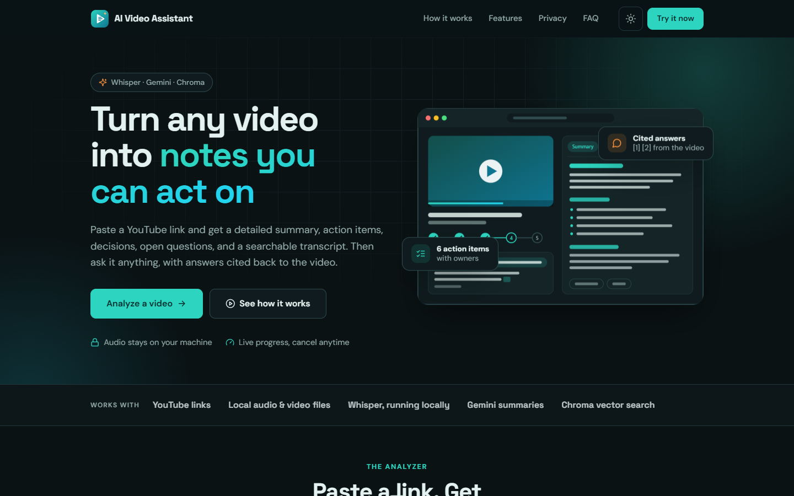
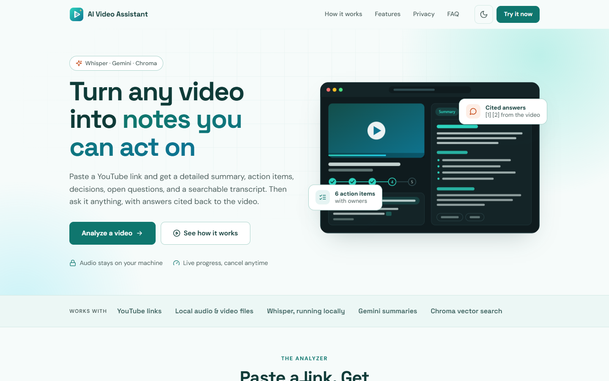
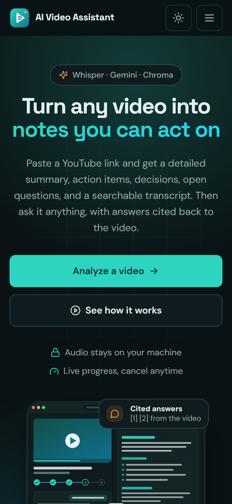
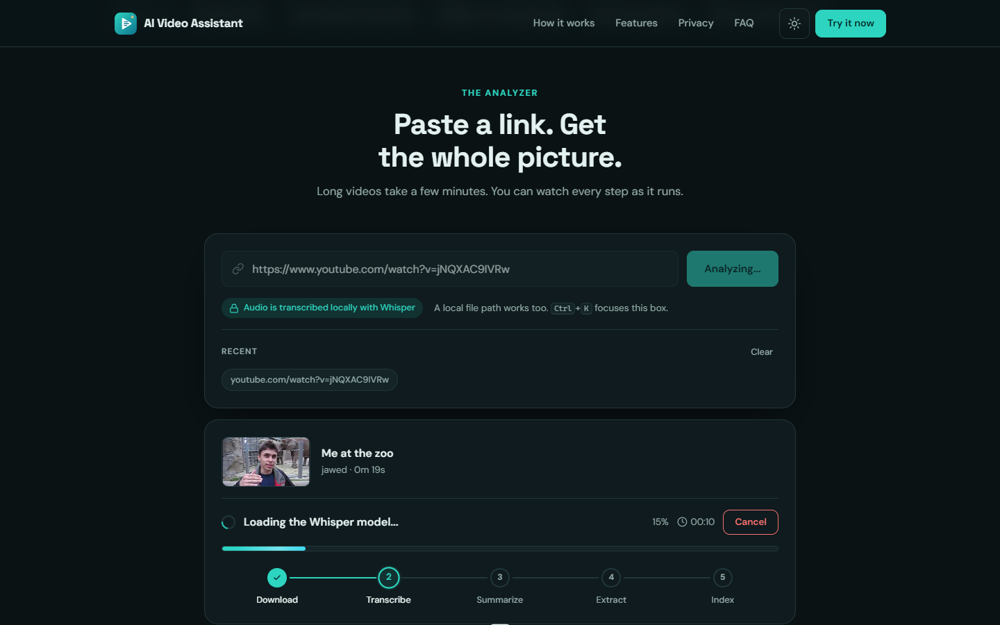
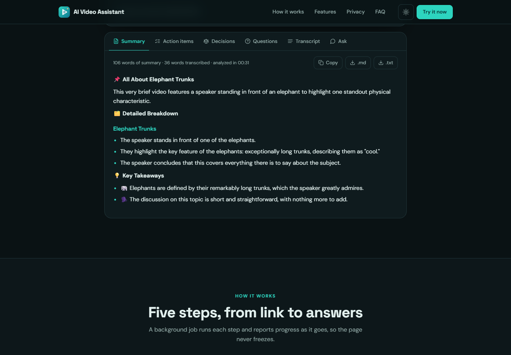
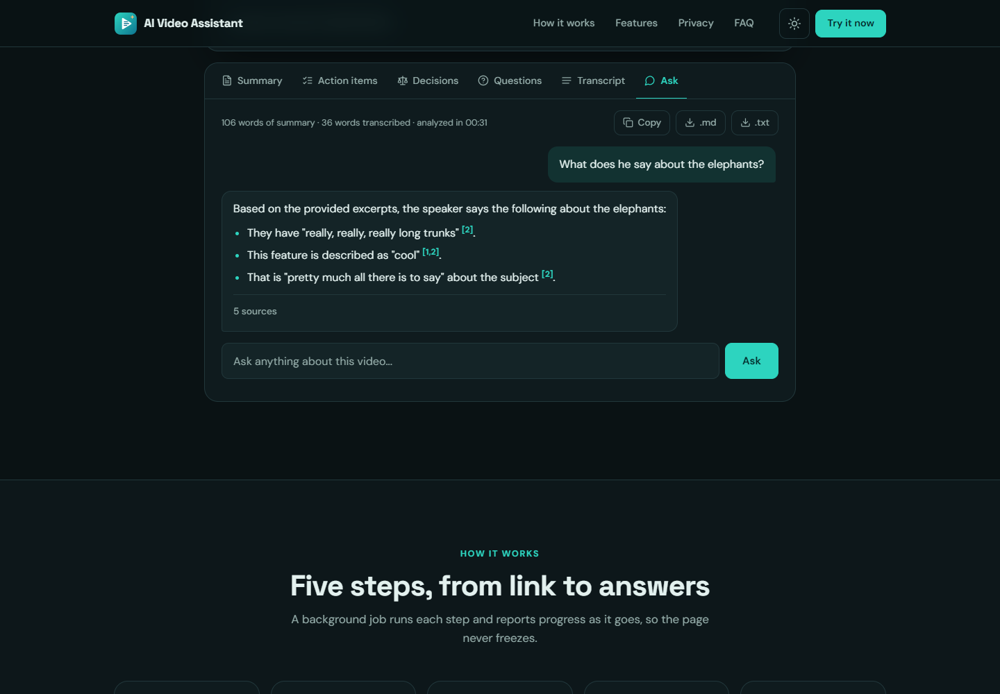
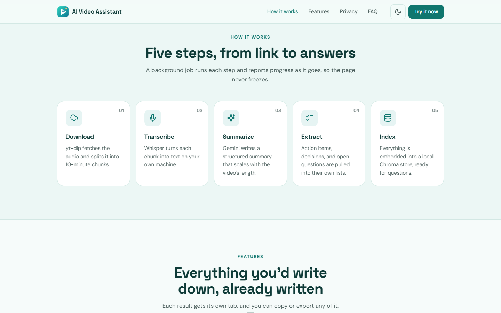
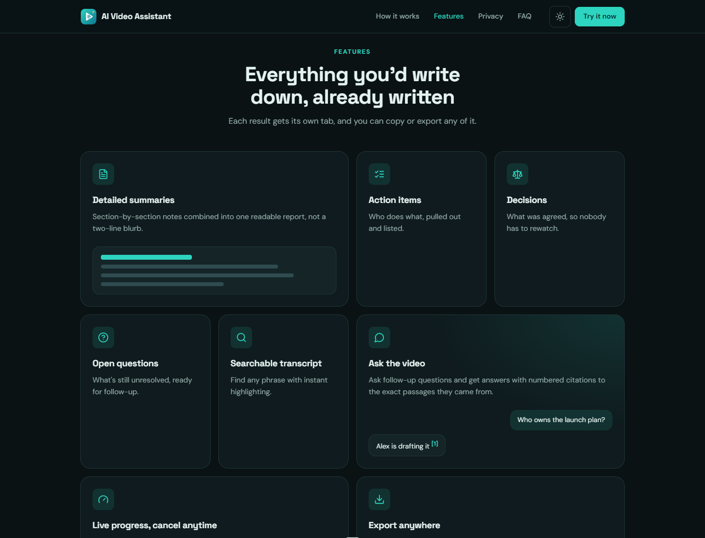
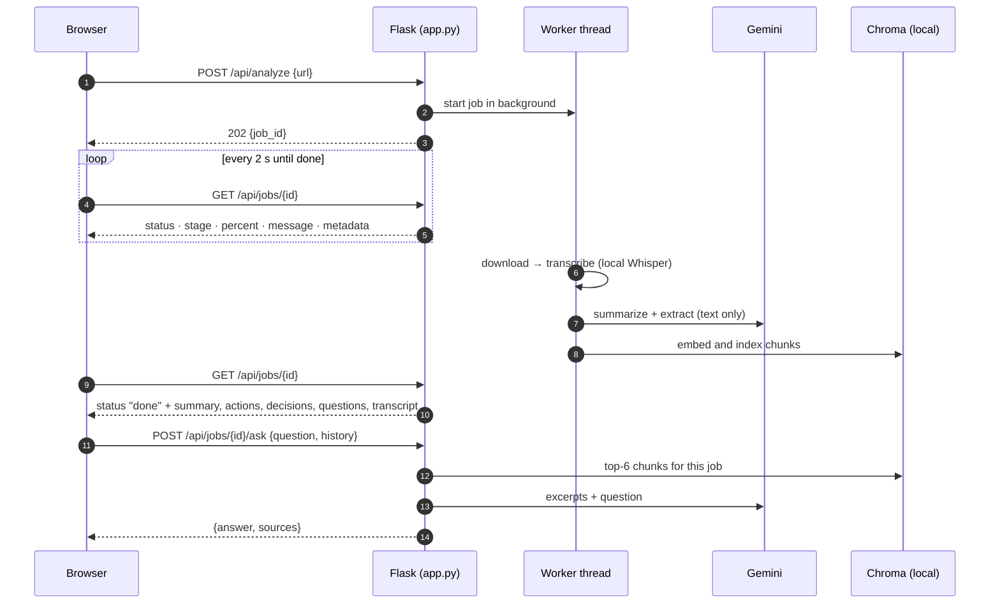

<div align="center">


# AI Video Assistant

**Turn any video into notes you can act on.**

Paste a YouTube link or a local audio/video file and get a detailed summary,
action items, decisions, open questions, and a searchable transcript — then ask
questions about the video and get answers cited back to it.




</div>

---

## Contents

- [Why](#why)
- [Features](#features)
- [Screenshots](#screenshots)
- [How it works — the complete workflow](#how-it-works--the-complete-workflow)
- [Tech stack](#tech-stack)
- [Getting started](#getting-started)
- [Usage](#usage)
- [Configuration](#configuration)
- [API](#api)
- [Project structure](#project-structure)
- [Testing](#testing)
- [Privacy and security](#privacy-and-security)
- [Limitations and roadmap](#limitations-and-roadmap)
- [Documentation](#documentation)
- [Contributing](#contributing)
- [Acknowledgements](#acknowledgements)

---

## Why

Long videos — recorded meetings, lectures, podcasts, tutorials — hold
information that is expensive to get back out. Finding one decision in a
50-minute recording means scrubbing through it.

AI Video Assistant turns a link into a structured document you can read in two
minutes, and lets you ask it follow-up questions. It runs on your own machine:
**audio is transcribed locally with Whisper and never leaves your computer.**
Only text is sent to Gemini.

## Features

| | |
| --- | --- |
| **Detailed summaries** | Section-by-section notes merged into one structured report whose length scales with the video |
| **Action items, decisions, open questions** | Each pulled out into its own tab |
| **Searchable transcript** | Full text with instant highlighting and a match count |
| **Ask the video** | Follow-up questions answered from the video only, with numbered citations and viewable sources |
| **Live progress** | Five named stages, per-chunk messages, percent, elapsed time, and a cancel button |
| **Video metadata** | Title, channel, duration, and thumbnail as soon as the download starts |
| **Export** | Copy any section, or download the full report (including Q&A) as `.md` or `.txt` |
| **Local-first** | Whisper transcription and the Q&A index both run on your machine |
| **Actionable errors** | Known failures (missing key, rate limit, FFmpeg, private video…) come with the fix |
| **Polished UI** | Landing page, light and dark themes, scroll animations, keyboard shortcuts, responsive down to 375px, accessible |

## Screenshots

| Light theme | Mobile |
| --- | --- |
|  |  |

**Live progress** — metadata appears within seconds; the stepper, bar, and
message update per stage and per audio chunk.



**Results** — six tabs: Summary, Action items, Decisions, Questions,
Transcript, and Ask.



**Ask the video** — answers come only from the analyzed video and cite the
excerpts they used.



| How it works | Features |
| --- | --- |
|  |  |

> The results shown are a real run on
> [*Me at the zoo*](https://www.youtube.com/watch?v=jNQXAC9IVRw), the 19-second
> first video uploaded to YouTube — which is why the summary is short.

---

## How it works — the complete workflow

### 1. What you do

1. **Paste** a YouTube URL (or a local file path) into the analyzer and press
   **Analyze** — or `Enter`.
2. **Watch it run.** Within seconds the video's title, channel, duration, and
   thumbnail appear. A five-step progress tracker shows each stage, with
   per-chunk messages, percent complete, and elapsed time. **Cancel** anytime.
3. **Read the results.** When it finishes, six tabs appear:
   - **Summary** — title, overview, section-by-section breakdown, key takeaways
   - **Action items** — who does what
   - **Decisions** — what was agreed
   - **Questions** — what is still open
   - **Transcript** — the full text, searchable
   - **Ask** — chat with the video
4. **Ask follow-ups** in the Ask tab — or tap a suggestion. Each answer cites
   excerpts as `[1]`, `[2]`; expand **sources** to read them.
5. **Export** — copy the current tab, or download the whole report (including
   your Q&A) as Markdown or plain text.

Recent links are remembered in your browser for one-click re-runs.

### 2. What happens behind the scenes

```mermaid
flowchart LR
    A([YouTube URL<br/>or local file]) --> B[1 · Download<br/>yt-dlp + FFmpeg]
    B --> C[2 · Transcribe<br/>Whisper, locally]
    C --> D[3 · Summarize<br/>Gemini map-reduce]
    D --> E[4 · Extract<br/>actions · decisions · questions]
    E --> F[5 · Index<br/>Chroma + local MiniLM]
    F --> G([Results in 6 tabs])
    G -. question .-> H[Ask<br/>retrieve top-6 → Gemini]
    H -. cited answer .-> G

    classDef local fill:#0f766e,stroke:#2dd4bf,color:#fff
    classDef cloud fill:#9a3412,stroke:#fb923c,color:#fff
    class B,C,F local
    class D,E,H cloud
```



<sub>Teal steps run on your machine. Orange steps send **text only** to Gemini.</sub>

| # | Stage | Module | What it does | Progress |
| --- | --- | --- | --- | --- |
| 1 | **Download** | [`utils/audio_processor.py`](utils/audio_processor.py) | `yt-dlp` fetches the best audio and its metadata in one call; FFmpeg converts it to mono 16 kHz WAV; it is split into 10-minute chunks. Local files skip the download. | 0 → 15% |
| 2 | **Transcribe** | [`core/transcriber.py`](core/transcriber.py) | Whisper transcribes each chunk locally — `faster-whisper` (CTranslate2, int8, voice-activity filter) when available, `openai-whisper` as a fallback. Progress and cancellation are checked between chunks. | 15 → 70% |
| 3 | **Summarize** | [`core/summarize.py`](core/summarize.py) | Map-reduce: the transcript is split into 6,000-character sections (400 overlap), Gemini writes notes per section, then combines them into one structured summary whose target length is banded to the transcript size. | 70 → 88% |
| 4 | **Extract** | [`core/extractor.py`](core/extractor.py) | Three focused Gemini calls pull out action items, decisions, and open questions, each returning an exact "none found" sentinel when empty. | 88 → 96% |
| 5 | **Index** | [`core/vector_store.py`](core/vector_store.py) | The transcript (900-char chunks) and generated sections (1,500-char chunks) are embedded with Chroma's local ONNX all-MiniLM-L6-v2 into a persistent store at `data/chroma/`, tagged with the job id. A failure here never fails the job. | 96 → 100% |
| — | **Ask** | [`core/rag_engine.py`](core/rag_engine.py) | Retrieves the six most relevant chunks **for that video only**, sends them with the question and recent turns to Gemini, and returns an answer that cites excerpts as `[n]` — or says the video doesn't cover it. | on demand |

### 3. How the browser and server talk

Transcription can take minutes, so a request never waits for it. The browser
starts a **background job** and polls it every two seconds.



Jobs live in memory, guarded by a lock, pruned after two hours (max 50). The
Q&A index lives on disk, so questions still work after a job is pruned or the
server restarts. Cancellation is cooperative: `POST /api/jobs/{id}/cancel` sets
a flag the worker checks between stages and audio chunks.

Deeper detail: [docs/ARCHITECTURE.md](docs/ARCHITECTURE.md).

---

## Tech stack

| Layer | Technology |
| --- | --- |
| Backend | Python 3.10+, Flask, background threads |
| Audio | yt-dlp, FFmpeg, pydub |
| Transcription | faster-whisper (preferred) / openai-whisper — local |
| LLM | Google Gemini via REST (`core/gemini_client.py`) |
| Retrieval | ChromaDB with local ONNX all-MiniLM-L6-v2 embeddings, LangChain text splitters |
| Frontend | Plain HTML, CSS, and JavaScript — no framework, no build step |
| Design | Space Grotesk + DM Sans, Lucide SVG icons, custom SVG illustrations |
| Tests | Dependency-free Python and Node suites |

---

## Getting started

### Prerequisites

| Requirement | Check |
| --- | --- |
| Python 3.10+ (developed on 3.11) | `python --version` |
| [FFmpeg](https://ffmpeg.org/download.html) on your `PATH` | `ffmpeg -version` |
| A [Google AI Studio API key](https://aistudio.google.com/apikey) (free tier works) | — |
| ~1 GB free disk for models and audio | — |

Install FFmpeg with `winget install Gyan.FFmpeg` (Windows),
`brew install ffmpeg` (macOS), or `sudo apt install ffmpeg` (Debian/Ubuntu),
then open a new terminal.

### Install

```bash
git clone https://github.com/hmzasaed/video-agent-AI.git
cd video-agent-AI

python -m venv .venv
# Windows (PowerShell)
.\.venv\Scripts\Activate.ps1
# macOS / Linux
source .venv/bin/activate

pip install -r Requirements.txt
```

### Configure

```bash
# Windows: Copy-Item .env.example .env
cp .env.example .env
```

Open `.env` and set your key:

```ini
GOOGLE_API_KEY=your_actual_key_here
```

`.env` is git-ignored — never commit it.

### Run

```bash
python app.py
```

Open **<http://127.0.0.1:5000>**, paste a link, and press **Analyze**.

Check the configuration took effect:

```bash
curl http://127.0.0.1:5000/api/health
# {"status":"ok","whisper_model":"base","gemini_key_configured":true,"jobs":{"running":0,"retained":0}}
```

**First run is slower:** the Whisper model (~145 MB for `base`) and the Q&A
embedding model (~80 MB) each download once. Full setup guide:
[docs/SETUP.md](docs/SETUP.md).

---

## Usage

### Web app

| Action | How |
| --- | --- |
| Start an analysis | Paste a URL or path, press `Enter` or **Analyze** |
| Jump to the input from anywhere | `Ctrl`/`Cmd` + `K` |
| Switch result tabs | Click, or `←` / `→` |
| Search the transcript | Transcript tab → search box |
| Ask a question | Ask tab → type, or pick a suggestion |
| Export | **Copy**, **.md**, or **.txt** above the results |
| Re-run a recent link | Click it under **Recent** |
| Toggle theme | Sun/moon button (follows your OS until you choose) |

### Command line

Run the pipeline without the web UI and print everything to the terminal:

```bash
python test.py "https://www.youtube.com/watch?v=..."
```

---

## Configuration

All settings live in `.env` (see [`.env.example`](.env.example)).

| Variable | Default | Effect |
| --- | --- | --- |
| `GOOGLE_API_KEY` | *(required)* | Gemini authentication |
| `GEMINI_MODEL` | `gemini-3.5-flash-lite` | Model for summaries, extraction, and Q&A; `gemini-3.5-flash` gives richer output |
| `WHISPER_MODEL` | `base` | `tiny` · `base` · `small` · `medium` · `large` — larger is slower but more accurate |
| `CHROMA_DIR` | `data/chroma` | Where the Q&A index is stored |
| `RAG_TOP_K` | `6` | Excerpts retrieved per question |

`.env` is read once at startup — restart after changing it.

---

## API

| Method | Endpoint | Purpose |
| --- | --- | --- |
| `POST` | `/api/analyze` | Start a job from `{"url": "..."}` → `202 {job_id}` |
| `GET` | `/api/jobs/<id>` | Poll progress, then results |
| `POST` | `/api/jobs/<id>/cancel` | Ask a running job to stop → `202` |
| `POST` | `/api/jobs/<id>/ask` | `{"question", "history"}` → `{answer, sources}` |
| `GET` | `/api/health` | Liveness and effective configuration |

A job carries `status` (`running` / `done` / `error` / `cancelled`), `stage`,
`message`, `percent`, and `metadata`, and once finished `transcript`,
`summary`, `action_items`, `decisions`, `questions`, `qa_ready`, and
`qa_error`.

```bash
# start
curl -X POST http://127.0.0.1:5000/api/analyze \
     -H "Content-Type: application/json" \
     -d '{"url": "https://www.youtube.com/watch?v=jNQXAC9IVRw"}'

# poll
curl http://127.0.0.1:5000/api/jobs/<job_id>

# ask
curl -X POST http://127.0.0.1:5000/api/jobs/<job_id>/ask \
     -H "Content-Type: application/json" \
     -d '{"question": "What is the main point?"}'
```

Full reference, error codes, and a client example: [docs/API.md](docs/API.md).

---

## Project structure

```text
app.py                     Flask backend: routes and background job runner
test.py                    Command-line entry point
core/
  gemini_client.py         Gemini REST wrapper — the only place that calls Gemini
  transcriber.py           Whisper transcription (faster-whisper / openai-whisper)
  summarize.py             Map-reduce summarization with length banding
  extractor.py             Action items, decisions, questions
  vector_store.py          Chroma index of each analysis (local embeddings)
  rag_engine.py            Retrieval-augmented answers with citations
utils/
  audio_processor.py       Download, convert, and chunk audio
templates/
  index.html               Landing page, analyzer, and SVG icon sprite
static/
  css/style.css            Design tokens, components, motion, themes
  js/main.js               Analyzer: jobs, polling, rendering, Q&A, export
  js/site.js               Landing page: scroll reveals, nav, mobile menu
  img/                     Logo, favicons, illustrations
  site.webmanifest         Install metadata
tests/
  test_api.py              Backend suite (64 checks)
  test_frontend.mjs        Frontend suite (35 checks)
docs/                      Full documentation and screenshots
downloads/                 Downloaded and converted audio (git-ignored)
data/chroma/               Q&A vector index (git-ignored)
```

---

## Testing

```bash
python tests/test_api.py        # 64 checks — routes, job lifecycle, cancellation, errors, Q&A
node tests/test_frontend.mjs    # 35 checks — markdown rendering, XSS escaping, formatting, citations
```

Neither suite needs an API key, a network connection, or a downloaded video —
the pipeline and Gemini are stubbed. Both exit non-zero on failure, so they
drop straight into CI. See [docs/TESTING.md](docs/TESTING.md).

---

## Privacy and security

| Data | Where it goes |
| --- | --- |
| Audio | **Stays on your machine** — downloaded, converted, and transcribed locally |
| Q&A embeddings | **Stay on your machine** — computed locally, stored in `data/chroma/` |
| Transcript text | Sent to Gemini for summarizing and extraction |
| Questions | Sent to Gemini with up to six excerpts from that video |
| API key | Read from `.env`, sent only to Google; never logged or returned |

The page also loads its fonts from Google Fonts; no analysis data is included.

> [!WARNING]
> This is a **local, single-user development server**. It has no
> authentication, runs with Flask's debugger on, and passes URLs and file paths
> to the pipeline unvalidated. Keep it bound to `127.0.0.1`. Read
> [docs/SECURITY.md](docs/SECURITY.md) before exposing it to any other machine.

---

## Limitations and roadmap

**Known limits:** jobs are held in memory and lost on restart; cancellation
waits for the current audio chunk; prompts assume English; there is no
automatic retry on Gemini rate limits; `downloads/` is never cleaned up.

**Next up:** retry with backoff on rate limits, automatic cleanup of
`downloads/`, persistent job history, caching by video ID, timestamped
citations, and optional local-LLM support. See
[docs/ROADMAP.md](docs/ROADMAP.md).

---

## Documentation

| Document | For |
| --- | --- |
| [PRD](docs/PRD.md) | What it does and what counts as done |
| [Architecture](docs/ARCHITECTURE.md) | How it is built and why |
| [Design](docs/DESIGN.md) | UI tokens, landing page, components, motion, accessibility |
| [API](docs/API.md) | Endpoint reference |
| [Setup](docs/SETUP.md) | Installing on a new machine |
| [Testing](docs/TESTING.md) | Running and extending the suites |
| [Troubleshooting](docs/TROUBLESHOOTING.md) | Fixing a specific error |
| [Security](docs/SECURITY.md) | Trust boundaries and deployment checklist |
| [Decisions](docs/DECISIONS.md) | Architecture decision records |
| [Roadmap](docs/ROADMAP.md) | What's shipped and what's next |
| [Contributing](docs/CONTRIBUTING.md) | Adding code |

---

## Contributing

1. Follow [docs/SETUP.md](docs/SETUP.md) and confirm both test suites pass.
2. Make your change, matching the existing style (see
   [docs/CONTRIBUTING.md](docs/CONTRIBUTING.md)).
3. Keep every model- or user-supplied string going through `escapeHtml()` or
   `renderMarkdown()` before it reaches `innerHTML`.
4. Run both suites and confirm `git status` shows no `.env`, `downloads/`, or
   `data/`.
5. Open a pull request describing what changed and why.

---

## Acknowledgements

- [OpenAI Whisper](https://github.com/openai/whisper) and
  [faster-whisper](https://github.com/SYSTRAN/faster-whisper) for local
  transcription
- [yt-dlp](https://github.com/yt-dlp/yt-dlp) for downloading audio
- [Google Gemini](https://ai.google.dev/) for summaries and answers
- [Chroma](https://www.trychroma.com/) for the local vector store
- [Lucide](https://lucide.dev/) icons (ISC licence)
- [Space Grotesk](https://fonts.google.com/specimen/Space+Grotesk) and
  [DM Sans](https://fonts.google.com/specimen/DM+Sans) (SIL Open Font Licence)
